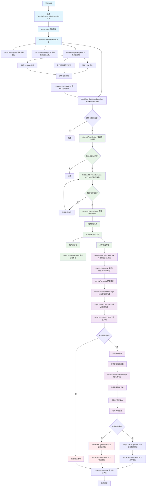

# Get Youtube Transcription (just one click)

一个简单实用的 Chrome 扩展，只需一次点击即可获取 YouTube 视频的转录文本。

## 功能特点

- ✅ 一键获取 YouTube 视频转录
- ✅ 优先获取原始语言转录（而非自动翻译）
- ✅ 自动复制转录内容到剪贴板
- ✅ 按钮样式与 YouTube 界面和谐融合
- ✅ 支持明暗主题
- ✅ 响应式设计，适配移动端
- ✅ 智能错误处理

## 安装方法

### 开发者模式安装

1. 打开 Chrome 浏览器
2. 在地址栏输入 `chrome://extensions/`
3. 打开右上角的"开发者模式"开关
4. 点击"加载已解压的扩展程序"
5. 选择包含扩展文件的文件夹
6. 扩展将自动安装并启用

## 使用方法

1. 打开任意 YouTube 视频页面
2. 在视频下方的操作按钮区域找到"Transcript"按钮
3. 点击按钮，扩展会自动获取转录并复制到剪贴板
4. 粘贴到任何需要的地方使用

## 功能说明

### 转录获取策略

扩展使用多种方法获取转录：

1. **页面方法**：通过模拟点击转录按钮获取转录内容
2. **智能检测**：自动检测并展开视频描述区域查找转录按钮

### 语言优先级

- 优先获取视频的原始语言转录
- 如果是英文视频，获取英文转录
- 如果是中文视频，获取中文转录
- 避免获取自动翻译的版本

### 错误处理

- 如果视频没有转录，会显示友好的提示信息
- 如果获取失败，会显示错误提示
- 所有操作都有适当的用户反馈

## 技术特点

- 使用 Manifest V3 规范
- 纯 JavaScript 实现，无外部依赖
- 响应式设计，适配各种屏幕尺寸
- 兼容 YouTube 的明暗主题
- 智能检测页面变化，支持 SPA 导航

## 文件结构

```
├── manifest.json          # 扩展配置文件
├── content.js            # 主要功能脚本
├── styles.css            # 样式文件
└── README.md             # 说明文档
```

## 兼容性

- Chrome 88+
- Microsoft Edge 88+
- 其他基于 Chromium 的浏览器

## 开发说明

### 执行流程图



### 主要组件

1. **YoutubeTranscriptionExtension 类**
   - 处理按钮注入和转录获取
   - 监听页面导航变化
   - 管理用户界面交互

2. **核心方法说明**
   - `setupDataCapture()`: 设置数据捕获机制，监听 DOM 变化和脚本注入
   - `observePageNavigation()`: 监听页面导航变化，支持 SPA 单页应用
   - `startObservingButtonContainer()`: 智能检测按钮容器出现时机
   - `attemptToAddButton()`: 尝试添加转录按钮到合适位置
   - `handleTranscriptButtonClick()`: 处理转录按钮点击事件
   - `extractTranscriptFromPage()`: 从页面提取转录的主要流程
   - `extractTranscriptContent()`: 从转录面板提取具体内容

3. **用户界面**
   - 自适应按钮设计
   - 通知系统
   - 错误处理和调试信息

### 关键技术实现

#### 页面变化监听
- 使用 MutationObserver 监听 DOM 变化
- 监听 `popstate` 事件和 YouTube 自定义事件
- 支持单页应用的路由变化

#### 按钮智能插入
- 多种容器查找策略
- 按钮有效性验证
- 自动重新插入机制

#### 转录提取策略
- 优先尝试页面方法（模拟点击）
- 多种转录内容选择器
- 智能文本清理和时间戳处理

#### 错误处理
- 详细的调试信息输出
- 用户友好的错误提示
- 全局调试方法支持

### 自定义样式

扩展使用 CSS 变量来适配 YouTube 的主题系统：

```css
background: var(--yt-spec-button-chip-background-hover, #f1f1f1);
color: var(--yt-spec-text-primary, #0f0f0f);
```

## 注意事项

1. 确保视频有转录功能可用
2. 某些受版权保护的视频可能无法获取转录
3. 扩展仅在 YouTube 视频页面工作
4. 需要网络连接来获取转录数据

## 故障排除

### 按钮不显示
- 确保页面完全加载
- 刷新页面重试
- 检查是否在视频页面

### 无法获取转录
- 确认视频有转录功能
- 检查网络连接
- 尝试切换到有转录的视频

### 样式问题
- 清除浏览器缓存
- 重新加载扩展
- 检查 YouTube 主题设置

### 调试工具
- 在浏览器控制台运行 `window.getTranscript()` 来手动检查转录面板
- 查看控制台输出了解详细执行流程

## 更新日志

### v1.0
- 初始版本发布
- 基本转录获取功能
- 响应式设计
- 主题支持

## 许可证

MIT License

## 贡献

欢迎提交 Issues 和 Pull Requests！

## 联系方式

如有问题或建议，请通过 GitHub Issues 联系。