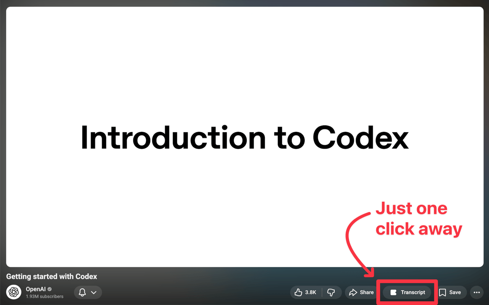
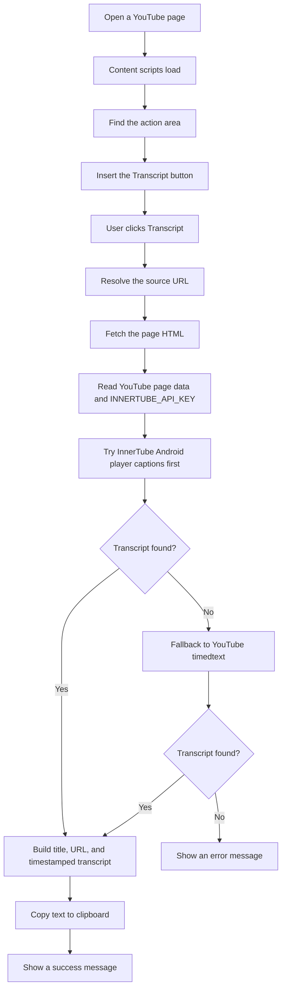

# Get YouTube Transcription

## What It Is

This is a Chrome extension for YouTube. It adds a `Transcript` button to YouTube video pages. Click the button to get the transcript and copy it to your clipboard.

## Install

1. Open `chrome://extensions/` in Chrome.
2. Turn on **Developer mode**.
3. Click **Load unpacked**.
4. Select this project folder.
5. Open a YouTube video page and check for the `Transcript` button.

## Use

1. Open a YouTube video page.
2. Click the `Transcript` button.
3. Wait a moment for the transcript to load.
4. Paste the copied text anywhere you want.

## Core Flow

```mermaid
flowchart TD
    A[Open a YouTube page] --> B[Content scripts load]
    B --> C[Find the action area]
    C --> D[Insert the Transcript button]
    D --> E[User clicks Transcript]
    E --> F[Resolve the source URL]
    F --> G[Fetch the page HTML]
    G --> H[Read YouTube page data and INNERTUBE_API_KEY]
    H --> I[Try InnerTube Android player captions first]
    I --> J{Transcript found?}
    J -- Yes --> K[Build title, URL, and timestamped transcript]
    J -- No --> L[Fallback to YouTube timedtext]
    L --> M{Transcript found?}
    M -- Yes --> K
    M -- No --> O[Show an error message]
    K --> P[Copy text to clipboard]
    P --> Q[Show a success message]
```
